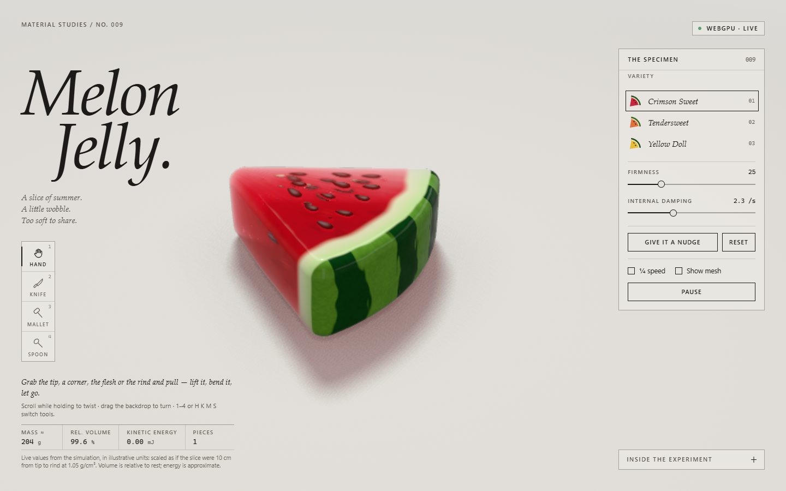
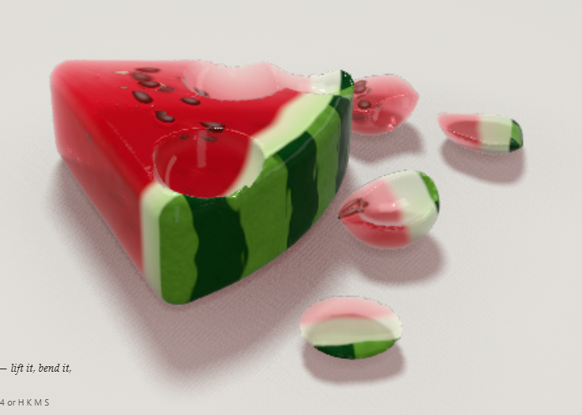
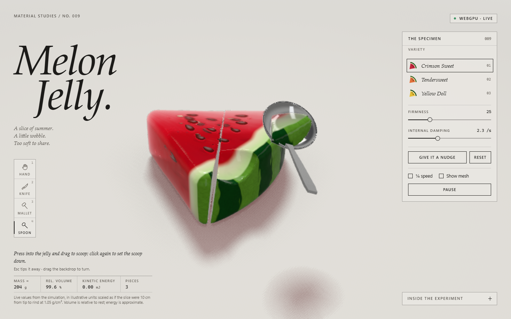
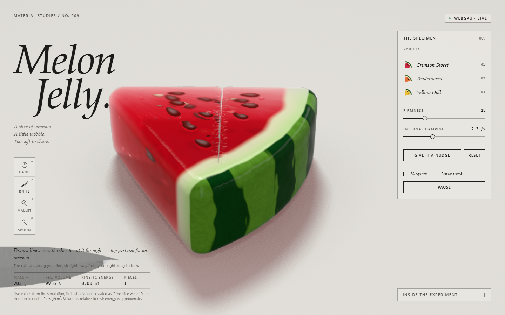

# Melon Jelly

*Material Studies No. 009: a slice of summer, a little wobble.*

An interactive watermelon-jelly slice you can grab, cut, strike and scoop. It is a real-time soft body, simulated with XPBD on a tetrahedral mesh and rendered with native WebGPU. Everything lives in one HTML file, with no build step and no dependencies.



## Run it

Open `melon-jelly.html` in a browser with WebGPU. Opening the file straight from disk works, and so does any static server:

```bash
npx serve .
```

Supported browsers:

- Chrome or Edge on desktop, and Chrome on Android.
- Safari 26 or later.
- Firefox 141 or later, on Windows.

Hardware acceleration must be on. Without WebGPU the page explains why it can't run. It never falls back to WebGL, video or a still image.

## Tools

| Tool | Key | What it does |
|---|---|---|
| **Hand** | `1` / `H` | Grab any piece and pull. Scroll while holding to twist; with a second finger on touch. Drag the backdrop to turn the view. |
| **Knife** | `2` / `K` | Draw a line across the slice to cut it in two. Stop partway for an incision. |
| **Mallet** | `3` / `M` | Click to strike. Hold, then release, for a harder blow. Press and drag down to squash. |
| **Spoon** | `4` / `S` | Press into the jelly and drag to scoop. The scoop rides in the bowl until you click to set it down; `Esc` tips it away. |

Other keys:

- `Space` pauses.
- `N` gives the slice a nudge.
- `R` resets to the pristine slice. Your preset and sliders are kept.

The panel has three varieties (Crimson Sweet, Tendersweet, Yellow Doll), sliders for firmness and damping, ¼ speed, and a mesh view that shows edges made by surgery in red.

<p>
  
  
</p>

## How it works

**The body.** The slice is a tetrahedral mesh. Every tet carries two XPBD constraints from a stable Neo-Hookean material: one resists changes of shape, the other preserves volume. A final pass never lets an element turn inside out. Physics runs at a fixed 120 Hz step split into 8 substeps, or 12 right after a cut or a hard blow. The simulation runs on the CPU in JavaScript.

**The surface.** What you see is not the lattice. It is a smooth, finely tessellated surface embedded in the deforming lattice. A WebGPU compute pass moves it every frame and rebuilds its normals, and positions the seeds and air bubbles the same way. Colour comes from a material field in rest space: flesh, pale rind and green skin. That is why any new face shows the right layers without texturing.

**The light.** A back-face pass measures how much jelly each pixel looks through. The front pass then:

- refracts the studio behind the slice;
- absorbs light by thickness (Beer–Lambert);
- adds internal scattering and Fresnel reflection;
- lets thin edges glow.

Soft shadows and contact occlusion come from a shadow map and a height map.

**Cutting and scooping.** These change the topology for real:

1. The knife's plane, or the spoon's swept bowl, is carried into the slice's rest space.
2. Each affected piece is re-tetrahedralised from its new shape.
3. The result is split into connected bodies.
4. It is handed back to the solver without a pause.

New nodes take their live position from the old mesh, so nothing jumps. Surgery runs as a time-sliced job alongside rendering. The finished result is swapped in whole, and no frame waits on it. Freshly cut faces render wetter and glossier. Seeds follow the flesh they sit in.

**The mallet.** Its head is a kinematic capsule, swept smoothly through the substeps. The jelly compresses, bulges and rebounds on its own. Hard blows throw a few droplets of juice.



## Tests

The tests use Node and a local Chrome or Edge, driven through `puppeteer-core`.

```bash
cd tests
npm install
npm test
```

| Suite | What it covers |
|---|---|
| `npm run test:physics` | Solver stability, volume, recovery from flings and folds, and the render embedding. Runs headless in Node, without a browser. |
| `npm run test:browser` | End-to-end in Chrome with WebGPU: grabbing, controls, every tool with mouse and touch, reduced motion, layouts from 360 px phones to 1920 px desktops, and the no-WebGPU fallback. |
| `npm run test:scenarios` | Tip cuts, cuts through seeds, incisions, scoops at edges and inside earlier scoops, stacked pieces, and repeated Reset. |
| `npm run test:selftest` | Runs the in-page self-test. |

The self-test is also in the page itself: open `melon-jelly.html?debug` and press **Run self-test**. It does three rounds of random cuts, scoops, strikes and drags on every piece, then Reset. After every step it checks:

- no NaNs;
- no inverted elements;
- no orphan particles;
- a closed, manifold boundary on every piece;
- every seed has a valid parent element.

After each Reset it checks that the scene matches the pristine snapshot exactly. The debug overlay also shows live counts and surgery timings.

Set `CHROME=/path/to/browser` if Chrome or Edge isn't found automatically.

## Limits

Buffers are allocated once, at fixed capacity. When an operation would exceed a limit, it is refused with a short note on screen.

| Resource | Capacity |
|---|---|
| Particles | 8,192 |
| Tetrahedra | 24,576 |
| Pieces | 24 |
| Render vertices | 131,072 |
| Operations per piece | 20 |

Known limitations:

- **Seeds** are never sliced. A seed stays whole in one piece, or leaves with the scooped material.
- **No self-collision.** Pieces collide with each other and the floor, but a single piece does not collide with itself. The two walls of an incision can pass through each other.
- **Cut plane.** The knife's plane passes through your eye along the stroke. A line drawn across the top face therefore cuts at an angle, not straight down.
- **Cut latency.** A cut appears 0.2–0.5 s after release. The blade's pass animation covers most of that wait.
- **Coarse physics mesh.** On cut pieces it is coarser than the drawn shape at the small rounded edges. The mass readout uses the drawn shape.

## Files

```
melon-jelly.html            the app: simulation core, surgery, WebGPU renderer and interface
melon-jelly.original.html   the version before the knife, mallet and spoon
tests/                      physics, browser, scenario and self-test suites
docs/                       screenshots for this readme
```
